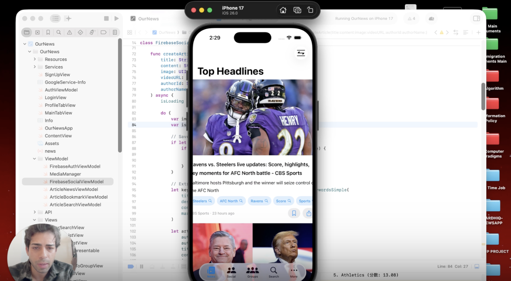

# OurNews (PulseNews: Personalized iOS News Platform)

A comprehensive iOS news application that combines real-time news aggregation with social networking features, built with SwiftUI and Firebase.

## Overview

OurNews is a modern news application that reimagines how users consume and interact with news content. By integrating social features with intelligent content discovery, OurNews creates an engaging platform where users can stay informed while connecting with others who share their interests.

## Demo

[](https://www.loom.com/share/ca05364bcfe748e5a077f065ab9667e7)

[](https://www.loom.com/share/4e28f5ec94de474e8b5cbfd0fe0e8526)

## Features

### News Aggregation
- **Real-time News Feed**: Aggregates news from multiple reputable sources
- **Smart Categorization**: NLP-powered keyword extraction automatically categorizes articles
- **Personalized Recommendations**: Tailored news suggestions based on user interests and reading history
- **Multi-source Integration**: Curated content from diverse news outlets

### Social Networking
- **User Profiles**: Customizable profiles with reading preferences and interests
- **Follow System**: Connect with users who share similar news interests
- **Article Sharing**: Share interesting articles with followers and groups
- **Group Discussions**: Create and join topic-based discussion groups
- **Comments & Interactions**: Engage in conversations around news articles

### Content Discovery
- **Keyword Extraction**: Advanced NLP algorithms identify key topics in articles
- **Topic-based Filtering**: Browse news by categories and trending topics
- **Search Functionality**: Find articles by keywords, topics, or sources
- **Bookmarks**: Save articles for later reading

## Tech Stack

- **Frontend**: SwiftUI
- **Backend**: Firebase
  - Firebase Authentication (User management)
  - Cloud Firestore (Real-time database)
  - Firebase Storage (Media storage)
  - Cloud Functions (Backend logic)
- **APIs**: News APIs for content aggregation
- **NLP**: Natural Language Processing for keyword extraction and categorization
- **Architecture**: MVVM (Model-View-ViewModel)

## Getting Started

### Prerequisites
- Xcode 14.0 or later
- iOS 16.0 or later
- A Firebase account
- A News API key (from newsapi.org or similar)

### Installation

1. Clone the repository
```bash
git clone https://github.com/hardhiqchoudhary-arch/OurNews-iOS.git
cd OurNews-iOS
```

2. Open the project in Xcode
```bash
open OurNews.xcodeproj
```

3. Configure Firebase
   - Create a new project at [Firebase Console](https://console.firebase.google.com)
   - Download `GoogleService-Info.plist` and add it to the project root
   - Enable Authentication, Firestore, and Storage in Firebase Console

4. Add your News API key
   - Obtain an API key from your news provider
   - Add it to `Config.swift` or your environment variables

5. Build and run
   - Select your target device or simulator in Xcode
   - Press `Cmd + R` to build and run

### How to Use

**Sign Up / Log In**
- Open the app and create an account using your email and password
- Or log in if you already have an account

**Browse News**
- The home feed shows real-time news aggregated from multiple sources
- Use the category tabs to filter by topic (Tech, Sports, Business, Health, etc.)
- Tap any article to read the full story in the built-in browser

**Personalize Your Feed**
- Go to your profile and set your interests
- The app will prioritize articles matching your preferences

**Social Features**
- Search for other users and follow them to see their shared articles
- Create or join groups around topics you care about
- Share interesting articles directly to your followers or a group

**Search & Bookmarks**
- Use the Search tab to find articles by keyword or topic
- Tap the bookmark icon on any article to save it for later reading

## Acknowledgments

- Firebase for backend infrastructure
- News API providers for content
- SwiftUI community for inspiration and resources
- Open-source NLP libraries

Note: This project was developed as part of academic coursework at George Washington University (September 2025 - December 2025).

- LinkedIn: [Hardhiq Choudhary](https://www.linkedin.com/in/hardhiq-choudhary)
- Email: hardhiq.choudhary@gwmail.gwu.edu